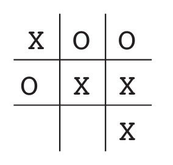
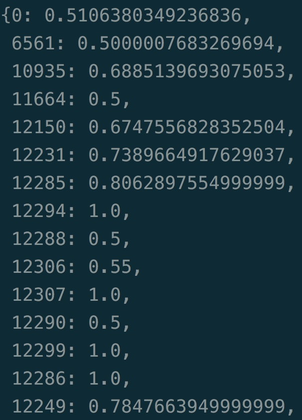

# 1. Introduction

## 书本介绍


[Reinforcement Learning](https://book.douban.com/subject/30323890/)

作者: Richard S. Sutton / Andrew G. Barto 

几乎是最权威的强化学习教材。

## 重要的符号表示

- $q_∗(a)$：动作a对应的真实价值（价值期望），true value (expected reward) of action a
- $Q_t(a)$：动作a在t时刻的估计价值，estimate at time t of $q_∗(a)$
- $N_t(a)$：在t时刻之前，动作a已经被选择的次数，number of times action a has been selected up prior to time t
- $H_t(a)$：在t时刻选择动作a的偏好程度，learned preference for selecting action a at time t
- $π_t(a)$：在t时刻选择动作a的概率，probability of selecting action a at time t
- $R_t$：给定策略$π_t$，在t时刻的期望奖励，estimate at time t of the expected reward given$π_t$

## 什么是强化学习

强化学习是“学习该如何去做”（learning what to do），即学习如何从**某个状态映射到某个行为，来最大化某个数值的奖励信号**。

## 强化学习的特征

强化学习两个最重要的特征：

- **试错**（trial-and-error search ）：agent需要不断尝试，通过reward的反馈学习策略。
- **延迟奖励**（delayed reward） ：某个时刻的action可能会对后面时刻的reward有影响（深远影响）。

### Exploit vs Explore

- **exploit**: 代表利用已有的信息去获得最大的奖励。
- **explore** 代表去探索一些没有尝试过的行为，去获得可能的更大的奖励。

## 强化学习的几个要素

- **policy**: 状态到行为的映射，定义agent在某个状态下应该如何采取行为，state $\rightarrow$ action。
- **reward function**: 在某个状态下，agent能够收到的**即时反馈**。
- **value function**: 衡量在某个状态下，能够获得的**长期反馈**。
- **modle (of the environment，可选的)**: 模型用来模拟环境的行为，**给定一个状态和动作，模型可以预测下一个状态和奖励**。

## RL vs Evolutionary Methods

- **Evolutionary Methods**（遗传算法，具体可以回顾[之前的博客](https://applenob.github.io/ga.html)），直接在policy空间中搜索，并计算最后的得分。通过一代代的进化来找寻最优policy。
- 遗传算法忽略了policy实际上是state到action的映射，它不关注agent和环境的互动，只看最终结果。

## 局限性

强化学习非常依赖**状态**（state）的概念。state既是策略函数和价值函数的输入，又是**环境模型**（model）的输入和输出。

## Tic-Tac-Toe（井字棋）



- 一个简单的应用强化学习的例子。
- 定义policy：任何一种局面下，该如何落子。

**遗传算法解法**：试很多种policy，找到最终胜利的几种，然后结合，更新。

**强化学习解法**：

- 1.建立一张表格，state_num × 1，代表每个state下，获胜的概率，这个表格就是所谓的**value function**，即状态到价值的映射。
- 2.跟对手下很多局。每次落子的时候，依据是在某个state下，选择所有可能的后继state中，获胜概率最大的（value最大的）。这种方法即贪婪法（Exploit）。偶尔我们也随机选择一些其他的state（Explore）。
- 3.**back up**后继state的v到当前state上。$V(s)\leftarrow V(s)+\alpha[V(s')-V(s)]$，这就是所谓的**差分学习**（temporal-difference learning），这么叫是因为$V(s')-V(s)$是两个时间点上的两次估计的差。

### 代码分析

[完整源码](https://github.com/ShangtongZhang/reinforcement-learning-an-introduction/blob/master/chapter01/tic_tac_toe.py)

游戏实现：

用`1`代表白棋，`-1`代表黑棋，若有连续的三个数之和为3则白赢，-3则黑赢。若所有绝对值之和为9，则游戏为平局。

```python
for result in results:
    if result == 3:
        self.winner = 1
        self.end = True
        return self.end
    if result == -3:
        self.winner = -1
        self.end = True
        return self.end

# whether it's a tie
sum = np.sum(np.abs(self.data))
if sum == BOARD_ROWS * BOARD_COLS:
    self.winner = 0
    self.end = True
    return self.end
```

定义状态字典：

```python
all_states = dict()
all_states[current_state.hash()] = (current_state, current_state.is_end())
```

其中，键名是状态的哈希值，值是状态对象以及该状态是否是终止状态。哈希值计算：

```python
# compute the hash value for one state, it's unique
def hash(self):
    if self.hash_val is None:
        self.hash_val = 0
        for i in self.data.reshape(BOARD_ROWS * BOARD_COLS):
            if i == -1:
                i = 2
            self.hash_val = self.hash_val * 3 + i
    return int(self.hash_val)
```

可以看到，状态的个数理论上应该是$3^9=19683$个，下面的价值表格的键数也一样是这个数字。

价值表格也是用dict实现：

```python
self.estimations = dict()
...
for hash_val in all_states.keys():
    (state, is_end) = all_states[hash_val]
    if is_end:
        if state.winner == self.symbol:
            self.estimations[hash_val] = 1.0
        elif state.winner == 0:
            # we need to distinguish between a tie and a lose
            self.estimations[hash_val] = 0.5
        else:
            self.estimations[hash_val] = 0
    else:
        self.estimations[hash_val] = 0.5
```

backup：

```python
# update value estimation
def backup(self):
    self.states = [state.hash() for state in self.states]

    for i in reversed(range(len(self.states) - 1)):
        state = self.states[i]
        td_error = self.greedy[i] * (self.estimations[self.states[i + 1]] - self.estimations[state])
        self.estimations[state] += self.step_size * td_error
```

决策使用epsilon-greedy：

```python
# choose an action based on the state
def act(self):
    state = self.states[-1]
    next_states = []
    next_positions = []
    for i in range(BOARD_ROWS):
        for j in range(BOARD_COLS):
            if state.data[i, j] == 0:
                next_positions.append([i, j])
                next_states.append(state.next_state(i, j, self.symbol).hash())

    if np.random.rand() < self.epsilon:
        action = next_positions[np.random.randint(len(next_positions))]
        action.append(self.symbol)
        self.greedy[-1] = False
        return action

    values = []
    for hash, pos in zip(next_states, next_positions):
        values.append((self.estimations[hash], pos))
    # to select one of the actions of equal value at random
    np.random.shuffle(values)
    values.sort(key=lambda x: x[0], reverse=True)
    action = values[0][1]
    action.append(self.symbol)
    return action
```

可以在终端和训练好的ai player对弈：


我试了好几局，都是平局，看来训练的还是不错的。



模型训练好后，保存的数据就是价值表格。但我们从中也可以看到一个问题，一个像tic-tac-toe这么简单的问题，使用价值表格保存所有状态的价值，也需要耗费大量的存储。
