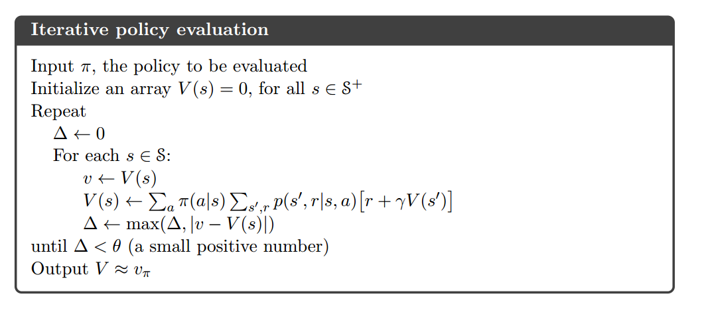
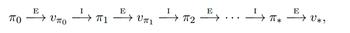
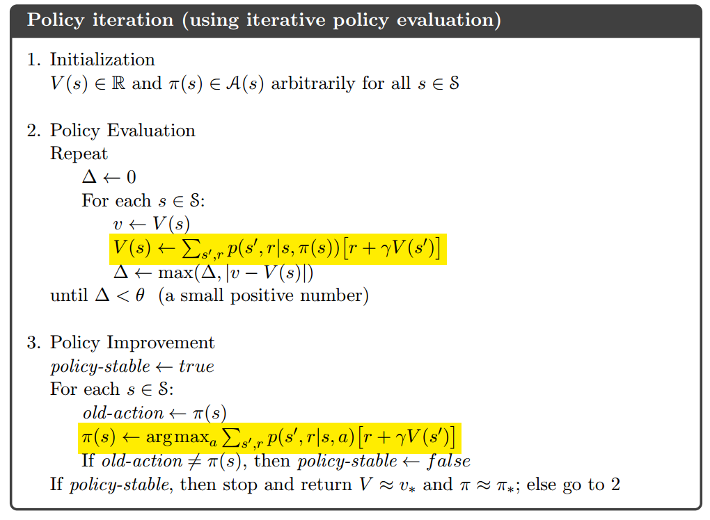
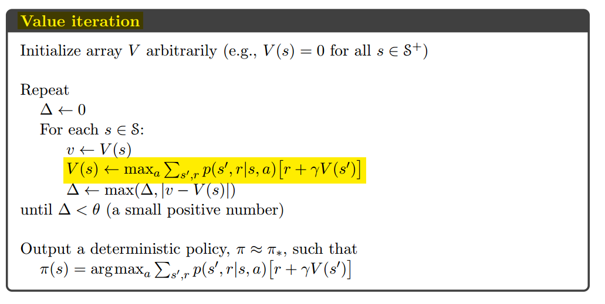

# 4. Dynamic Programming

## DP方法简介

- 由于其**大量的计算损耗**，已经**不实用**，但**理论上非常重要**。
- 本书后续的所有方法可以看做想要取得和DP类似的效果；只不过是减少了计算或者假设没有完美的环境模型。
- 假设解决的问题是有限的MDP，即给定动作a，状态s，和奖励r，可以通过$p(s',r|s,a)$描述动态变化。

## Policy Evaluation

- **评估一个策略的好坏。**
- **策略评估**：**计算某个policy对应的价值函数**，也被称为prediction problem。
- 更新方法：使用上一章讲的**Bellman Expectation Euqation for** $v_{\pi}$：$v_{\pi}(s) = \sum_a\pi(a|s)\sum_{s',r}p(s',r|s,a)[r+\gamma v_{\pi}(s')]\;\;\forall s \in S$



核心代码：

```python
src = new_state_values if in_place else state_values
...
value = 0
for action in ACTIONS:
    (next_i, next_j), reward = step([i, j], action)
    value += ACTION_PROB * (reward + src[next_i, next_j])
new_state_values[i, j] = value
```

其中，`step`函数即MDP的模型，会根据当前状态和动作产生下一个状态和奖励。

## Policy Improvement

在当前的策略和相应的价值函数的基础上，使用价值函数贪婪地更新当前策略的过程。

**policy improvement theorem**：对所有的$s \in S$，有$q_{\pi}(s, \pi'(s)) \geq v_{\pi}(s)$，则$v_{\pi'}\geq v_{\pi}(s)$，即策略$\pi'$优于策略$\pi$。

greedy policy：$\pi'(s)=\underset{a}{argmax}q_{\pi}(s,a)=\underset{a}{argmax}\sum_{s', r}p(s', r|s,a)[r+\gamma v_{\pi}(s')]$

核心代码：

```python
policy = np.zeros(value.shape, dtype=np.int)
...
# policy improvement
new_policy = np.copy(policy)
for i in range(MAX_CARS + 1):
    for j in range(MAX_CARS + 1):
        action_returns = []
        ...
        new_policy[i, j] = actions[np.argmax(action_returns)]
```

## Policy Iteration



其中，$E$代表策略的evaluation，$I$代表策略的improvement。简单地说，Policy Iteration就是不断地评估策略然后改进策略。



核心代码：

```python
policy_change = (new_policy != policy).sum()
if policy_change == 0:
    ...
    break
```

## Value Iteration

Policy Iteration的缺点：每一次迭代都要评估策略，而**每一次策略评估本身都是一个迭代过程**。

$v_{k+1}(s)=\underset{a}{max} E[R_{t+1}+\gamma v_k(S_{t+1})|S_t=s, A_t=a]$

$=\underset{a}{max}\sum_{s',r}p(s',r|s,a)[r+\gamma v_k(s')]$

实际上就是**Bellman Optimality Euqation for** $v_*(s)$。



**Value Iteration**简单地说就是每次评估价值的时候直接用可能的用**最优价值函数更新价值函数**（这样的每一步不涉及策略本身）；在确定已经获得比较准确的价值评估之后，再一次性确定策略。

核心代码：

```python
 # value iteration
while True:
    delta = 0.0
    for state in STATES[1:GOAL]:
        # get possilbe actions for current state
        actions = np.arange(min(state, GOAL - state) + 1)
        action_returns = []
        for action in actions:
            action_returns.append(
                HEAD_PROB * state_value[state + action] + (1 - HEAD_PROB) * state_value[state - action])
        new_value = np.max(action_returns)
        delta += np.abs(state_value[state] - new_value)
        # update state value
        state_value[state] = new_value
    if delta < 1e-9:
        break
```
