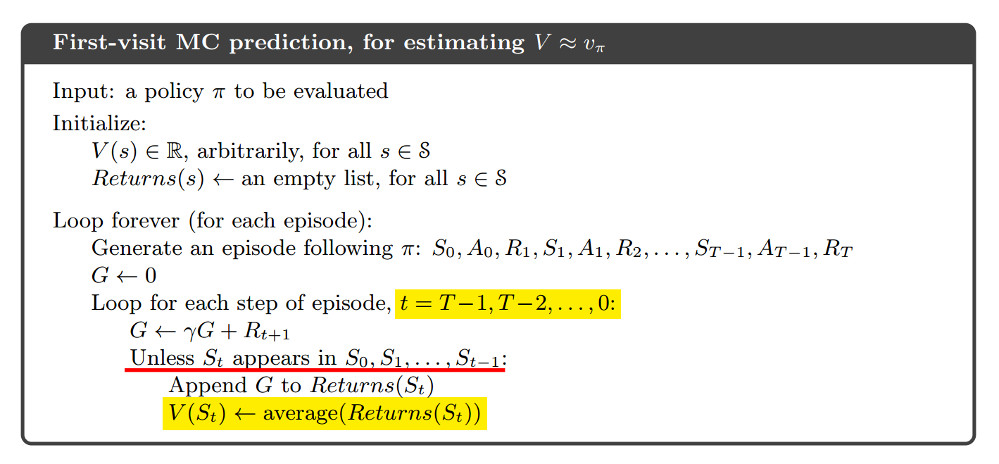
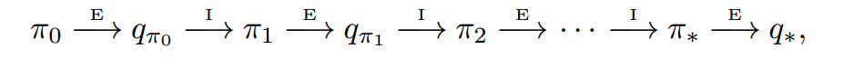
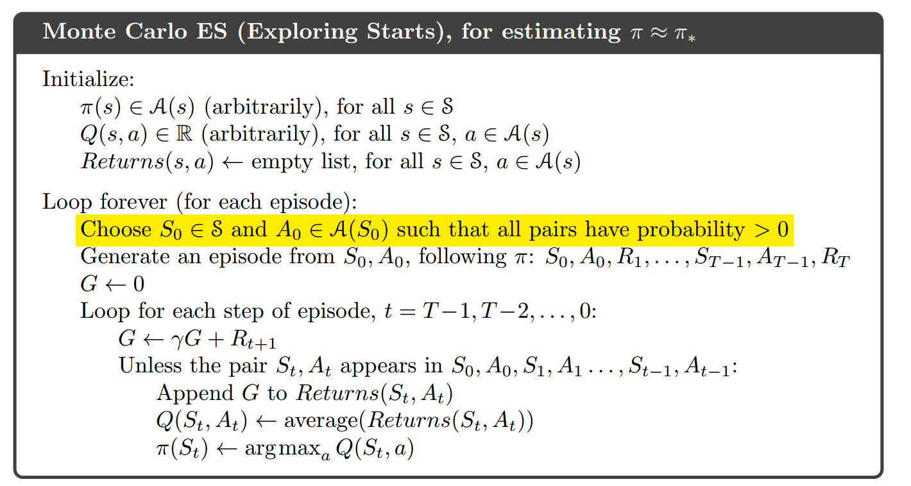
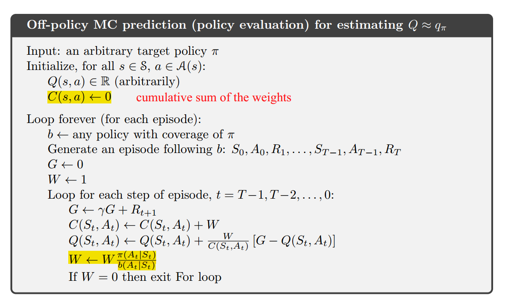
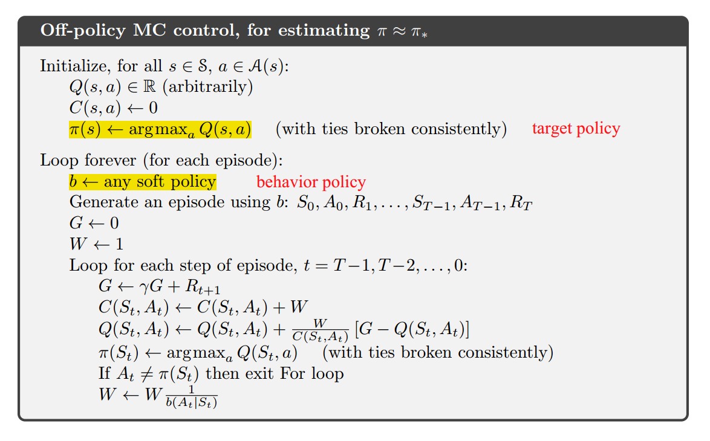

# 5. Monte Carlo Methods

## 蒙特卡洛方法简介

- 使用蒙特卡洛方法不需要像DP一样，对环境要有完整的知识，而是通过**经验**去学习。所谓经验就是对状态、动作、奖励的采样（sample sequence）。
- 用sample的均值去近似期望。
- 使用蒙特卡洛通常需要完整的episode，因此蒙特卡洛的更新方式更像是**episode-by-episode**，而不是像DP的step-by-step。
- 优点：
  - 1.可以从实际经验中学习；
  - 2.可以从模拟的经验中学习；
  - 3.可以直接从感兴趣的state开始采样episode。

## 蒙特卡洛预测（评估）

- 在一个episode中状态s可能出现多次，每一次出现称为一次对状态s的**访问（visit）**。
- **first-visit MC method**:只是用每个episode中第一次对状态s的访问评估状态s的价值函数。
- **every-visit MC method**:用每个episode中每次对状态s的访问评估状态s的价值函数。

$V(s)\leftarrow average(Return(s))$

## 蒙特卡洛评估动作价值函数（Action Values）

- **注意**：如果我们的问题中，没有对环境建模，那么单纯评估状态价值函数是不够的。我们必须要评估动作价值函数。
- **主体思想**：从评估state到评估state-action对。
- **可能存在的问题**：某些state-action对可能不会被访问（稀疏性问题）。

## 蒙特卡洛控制

- **控制**（control）的目的是找到最优策略。
- 
- 其中，$E$代表策略的evaluation，$I$代表策略的improvement。

## Monte Carlo Exploring Starts

- **Exploring Starts**：所有的state-action对都有可能被选为episode的开始（start）。

## 不使用Exploring Starts

- 如何才能不使用Exploring Starts？保证所有被选择的动作被持续地选择。
- 使用on-policy和off-policy。

## on-policy vs off-policy

- on-policy只有**一套policy**，更简单，是首选。
- off-policy使用**两套policy**，更复杂、更难收敛；但也更通用、更强大。
- on-policy和off-policy本质依然是Exploit vs Explore的权衡。

## on-policy

- 去评估和提高生成episode时采用的policy。**全过程只有一种策略**，MC ES属于on-policy。

## off-policy

- 所有的MC控制方法都面临一个**困境**：它们都想找到一个最优的策略，但却**必须采用非最优的策略去尽可能多地探索**（explore）数据。
- 直接使用**两套策略**：采样用的policy称为`behavior policy`，最终的目标policy：`target policy`。这就是off-policy。
- 假设目标策略是$\pi$，行为策略是$b$，那么对于所有的$\pi(a|s)>0$必然有$b(a|s)>0$，这称为“覆盖”（coverage）。一个常见的例子是：行为策略使用价值函数的greedy policy，而目标策略使用ε-greedy policy。

## 重要性采样（importance sampling）

几乎所有的off-policy都使用**重要性采样（importance sampling）**。

为什么要使用重要性采样？我们希望在使用目标策略$\pi$的情况下用均值估计价值的期望，但我们获得的是在使用行为策略$b$的情况下的均值，也就是：$\mathbb{E}[G_t \mid S_t =s] = v_b(s)$。这二者是有差距的。因此我们希望使用重要性采样去纠正。

给定初始状态$S_t$，后续的状态-动作轨迹在使用策略$\pi$的情况下的概率为：
$Pr\{At,S_{t+1}, A_{t+1}, ... S_T \mid S_t, A_{t:T −1} \sim \pi\}$ $=\prod_{k=t}^{T-1}\pi(A_k\mid S_k)p(S_{k+1}\mid S_k, A_k)$

引入**重要性采样比例（the importancesampling ratio）**：
$\rho_{t:T −1}=\frac{\prod_{k=t}^{T-1}\pi(A_k\mid S_k)p(S_{k+1}\mid S_k, A_k)}{\prod_{k=t}^{T-1}b(A_k\mid S_k)p(S_{k+1}\mid S_k, A_k)}$ $=\prod_{k=t}^{T-1}\frac{\pi(A_k\mid S_k)}{b(A_k\mid S_k)}$
上面这个式子正好巧妙地把MDP中未知的状态转移概率约掉。

于是return的期望又可以得到校正：$\mathbb{E}[\rho_{t:T−1}G_t \mid S_t =s] = v_{\pi}(s)$

odinary importance sampling：
$$V(s) = \frac{\sum_{t\in J(s)} \rho_{t:T (t)-1}Gt}{\mid J(s)\mid} $$

weighted importance sampling：
$$V(s) = \frac{\sum_{t\in J(s)} \rho_{t:T (t)-1}Gt}{\sum_{t\in J(s)} \rho_{t:T (t)-1}} $$

odinary importance sampling vs. weighted importance sampling:
  
  - odinary importance sampling：无偏差，但方差没有保证。
  - weighted importance sampling：有偏差，方差有上限。

评估：

上面的评估使用了采样权重增量式的方法。

控制：

