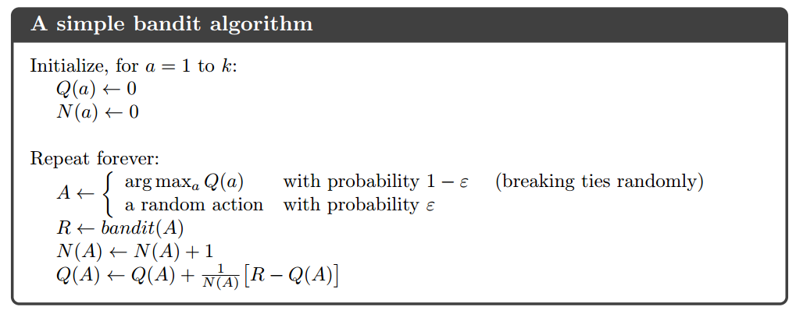
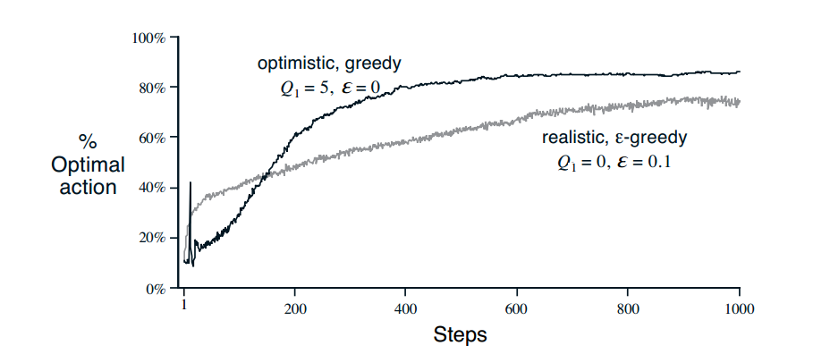

# 2. Multi-armed Bandits

## k-armed Bandit Problem，K臂老虎机

**问题描述**：重复地面临有k中选择的情况，每一次选择之后，都会收到一个reward。这个reward服从一个跟你的选择相关的分布。你的目标是，在选择t次后，找到**最大的期望reward**。

为什么叫K臂老虎机：有K个单臂老虎机，每个时间节点，你可以选择K个中任意一个老虎机选择按下它的臂，然后获得一个奖励。目标自然是多次选择之后的累计奖励最大。

**形式化定义**：假设时刻$t$的动作是$A_t$，reward是$R_t$，定义价值函数：$q_*(a) = E[R_t|A_t=a]$。

**特点**：每个时刻下，$q_*(a)$是固定的，stationary。

- 如果我们知道每个动作a对应的价值q，那么这个问题对我们来说就已经解决了，即，我们选择q最大的那个a。
- 然而，我们并不知道实际上的q是什么，只能估计$Q_t(a)\approx q_*(a)$。
- 在每个时间节点上，如果总是选择对应的估计Q最大的a，这被称为**greedy**。
- **$\epsilon$-greedy**：*：$1-\epsilon$的概率选择Q最大的a，*$\epsilon$的概率选择其他a。
- 估计$Q_t(a) = \frac{在时刻t之前，所有采用动作a获得的奖励之和}{在时刻t之前，采用动作a的次数} = \frac{\sum^{t-1}_{i=1}R_i\cdot\mathbf{1}_{A_i=a}}{\sum^{t-1}_{i=1}\mathbf{1}_{A_i=a}}$，被称为sample-average。

## 10-armed Testbed

- 设置一个10臂老虎机作模拟。
- 真实的价值函数$q_*(a)$服从标准高斯分布（均值是0，方差是1）。
- t时刻的奖励$R_t$服从高斯分布，均值是$q_*(A_t)$，方差是1。
- 可以规定每次实验做1000次选择，称为一个run。
- 一共跑了2000个独立的run。
- 实验结果（**$\epsilon$-greedy**的优越性）：
- 

### 增量式的估计

- 上面的sample-average即：$Q_n = \frac{R_1+R_2+...+R_{n-1}}{n-1}$
- 改写成增量式的形式：$Q_{n+1} = Q_n + \frac{1}{n}[R_n-Q_n]$
- 即：新估计 = 老估计 + 步长 × [奖励 - 老估计]
- 

### Optimistic Initial Values

- 设置初始的$Q_1(a)$为一些较大的值。
- 这样会鼓励explore。
- 对于nonstationary的问题不适用。
- 

## Upper-Confidence-Bound Action Selection（UCB）

- $A_t = \underset{a}{argmax}[Q_t(a)+c\sqrt{\frac{log\;t}{N_t(a)}}]$
- 其中，$N_t(a)$代表动作a在t之前出现的次数，根号项衡量动作a的不确定性，如果某个动作已经使用了很多次，则倾向使用使用次数少的，这样达到explore的效果。
- 

## Gradient Bandit Algorithms

- 使用一个数值表示对某个动作的**偏好**：$H_t(a)$
- $Pr\{A_t=a\}=\frac{e^{H_t(a)}}{\sum_{b=1}^k{e^{H_t(b)}}}=\pi_t(a)$
- 更新规则（不必细究，学到policy gradient自然明白）：
    - $H_{t+1}(A_t) = H_t(A_t) + \alpha(R_t-\overline R_t)(1-\pi _t(A_t))$
    - $\forall a \neq A_t$
- 

## 各种方法对比

- 