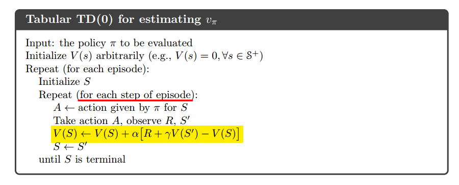
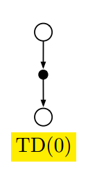
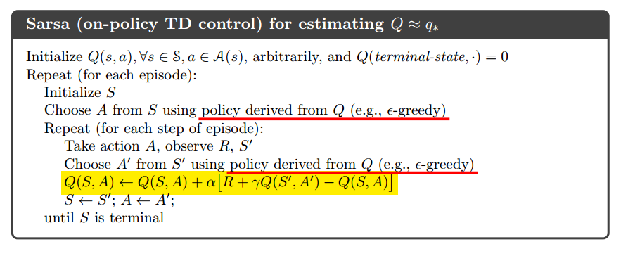
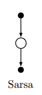
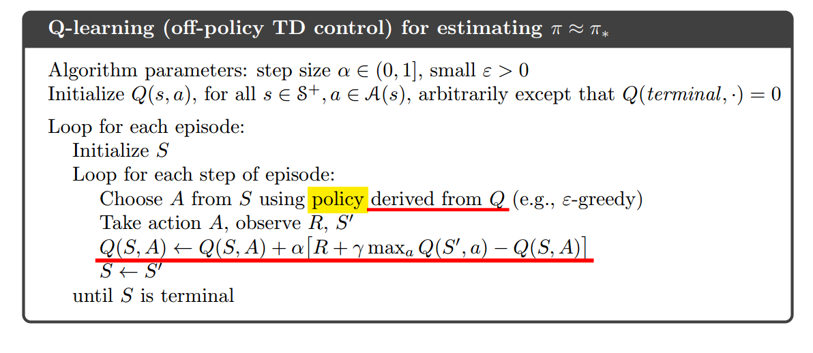
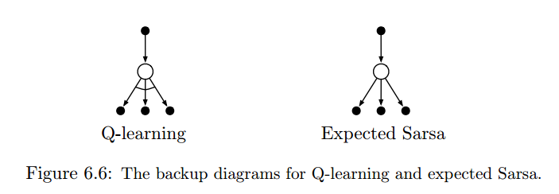
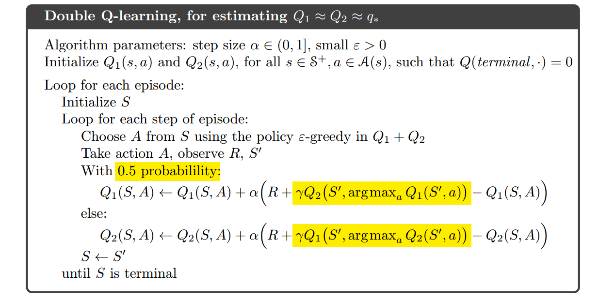

# 6. Temporal-Difference Learning

## 时序差分（Temporal-Difference）简介

- 时序差分是强化学习的核心观点。
- 时序差分是DP和MC方法的结合。
- 时序差分不需要像MC一样，要等一个完整的序列结束；相反，每经历一步，都会更新价值函数。
- TD往往比MC高效
- 所谓差分就是下一个时刻的估计和当前时刻的估计的差。

## 什么是stationary？

- stationary：环境不随时间变化而变化；
- non-stationary：环境会随时间变化而变化。

## TD(0)

$V(S_t)\leftarrow V(S_t)+\alpha[R_{t+1}+\gamma V(S_{t+1})-V(S_t)]$

因为直接使用现有的估计取更新估计，因此这种方法被称为**自举（bootstrap）**。

**TD error**：$\delta_t = R_{t+1}+\gamma V(S_{t+1})-V(S_t)$

## Sarsa

- 一种on-policy的TD控制。
- $Q(S_t,A_t)\leftarrow Q(S_t,A_t)+\alpha[R_{t+1}+\gamma Q(S_{t+1},A_{t+1})-Q(S_t,A_t)]$

## Q-learning

- 一种off-policy的TD控制。
- 早期强化学习的一个**突破**。
- $Q(S_t,A_t)\leftarrow Q(S_t,A_t)+\alpha[R_{t+1}+\gamma \underset{a}{max}Q(S_{t+1},a)-Q(S_t,A_t)]$

## Expected Sarsa

- 一种off-policy的TD控制。
- $Q(S_t,A_t)\leftarrow Q(S_t,A_t) + \alpha[R_{t+1} + \gamma\sum_a\pi(a|S_{t+1})Q(S_{t+1}, a)-Q(S_t,A_t)]$

## Double Learning

- 解决Q-learning的**最大化偏差（maximization bias）**问题
- 2011年提出。

