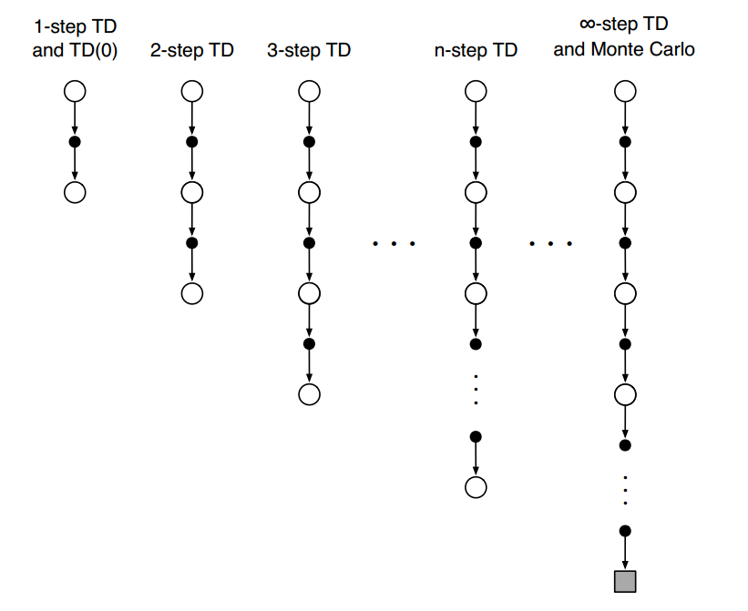
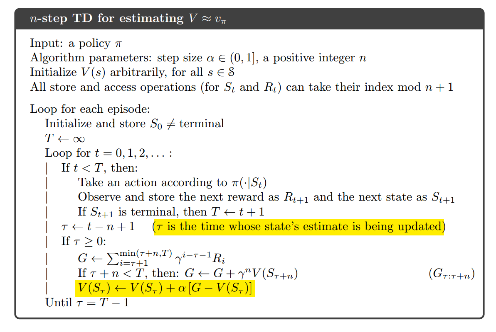
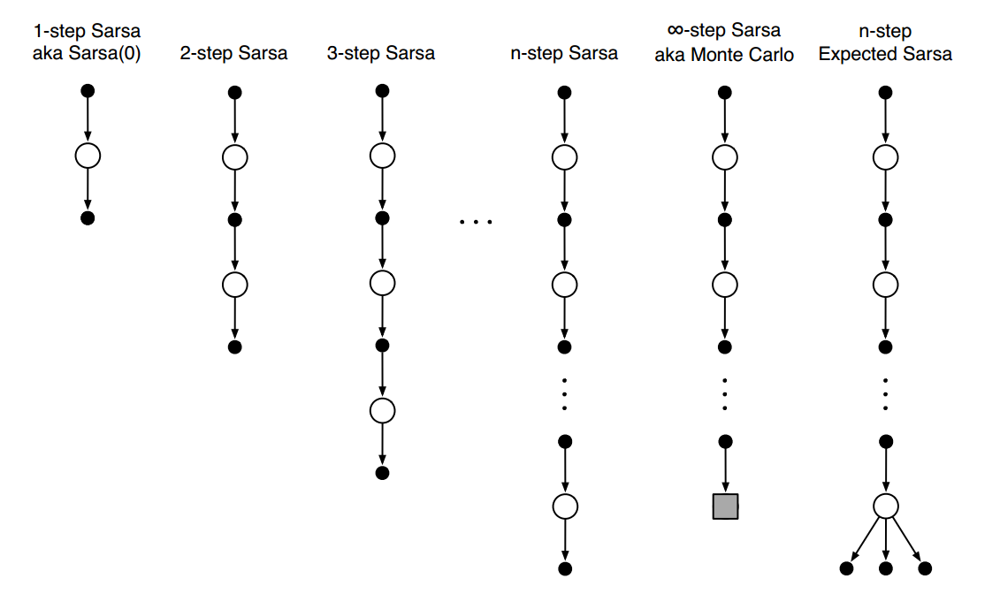
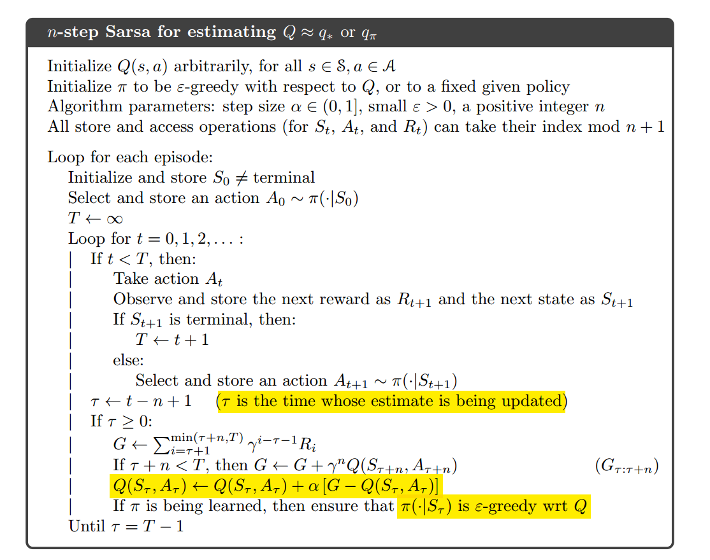
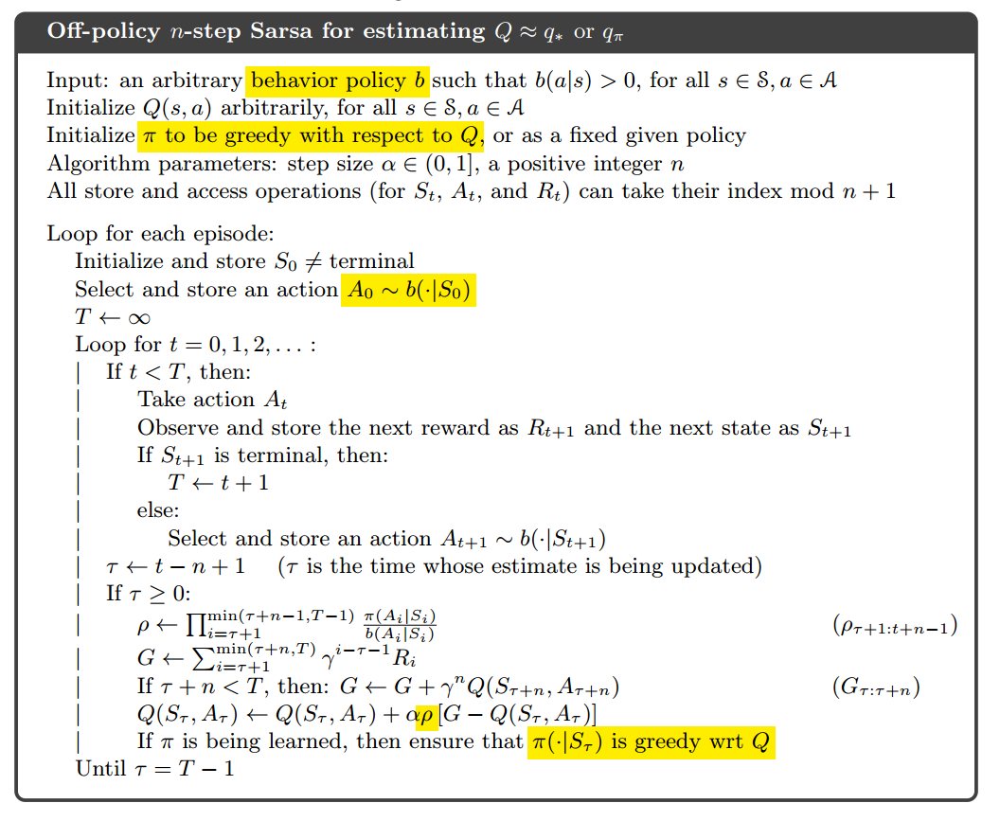
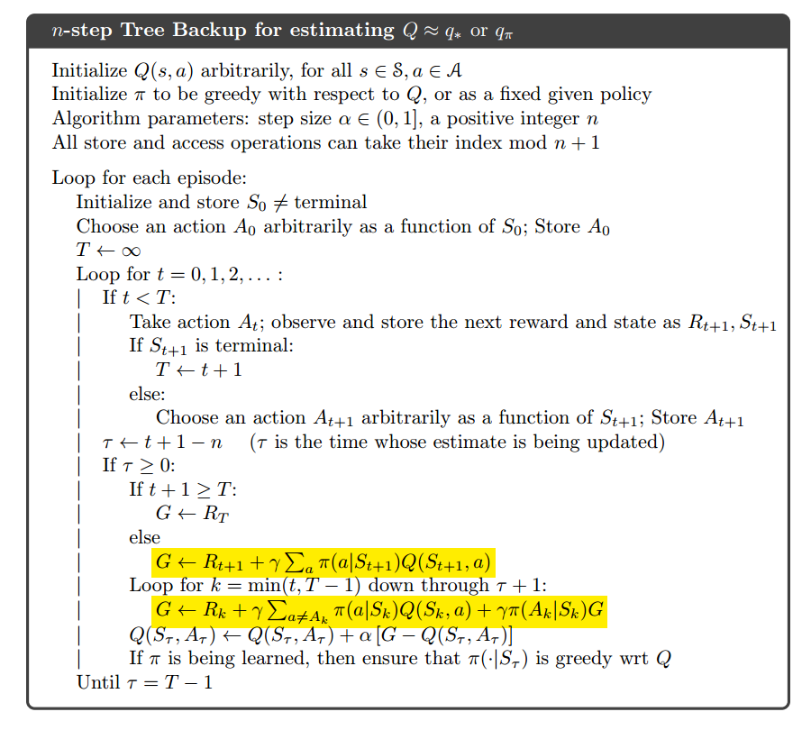
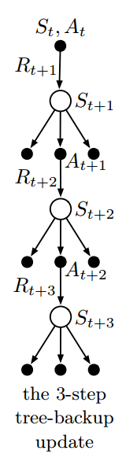

# 7. n-step Bootstrapping

## n-step Bootstrapping简介

- 是MC方法和一步TD方法的结合。
- 是**资格痕迹**（eligibility traces）的基础先验知识。

## n-step TD Prediction

- MC对应的回报：$G_t = R_{t+1}+\gamma R_{t+2}+...+\gamma^{T-t-1}R_T$
- 一步TD对应的回报：$G_{t:t+1} = R_{t+1} + \gamma V_t(S_{t+1})$
- n-step的回报：$G_{t:t+n} = R_{t+1} + \gamma R_{t+2}+...+\gamma^{n-1}R_{t+n}+\gamma^nV_{t+n+1}(S_{t+n})$

## n-step Sarsa

- n-step Sarsa: 
- 回报：$G_{t:t+n} = R_{t+1} + \gamma R_{t+2} + \gamma^{n-1} R_{t+n} + \gamma^nQ_{t+n-1}(S_{t+n}, A_{t+n})$
- 更新动作价值函数：$Q_{t+n}(S_t, A_t) = Q_{t+n-1}(S_t, A_t) + \alpha[G_{t:t+n} - Q_{t+n-1}(S_t,A_t)]$
- n-step Expected Sarsa:
- 回报：$G_{t:t+n} = R_{t+1} + \gamma R_{t+2} + \gamma^{n-1} R_{t+n} + \gamma^n \bar V_{t+n-1}(S_{t+n})$
- 更新价值函数：$\bar V_t(s) = \sum_a \pi(a|s)Q_t(s,a)$

- 

## n-step off-policy with Importance Sampling

- 更新动作价值函数：$Q_{t+n}(S_t， A_t) = Q_{t+n-1}(S_t, A_t) + \alpha \rho_{t:t+n-1}[G_{t:t+n} - Q_{t+n-1}(S_t, A_t)]$
- 其中，重要性采样比例：$\rho_{t:h} = \prod_{k=t}^{min(h,T-1)}\frac{\pi(A_k|S_k)}{b(A_k, S_k)}$

## n-step Tree Backup Algorithm

- 不需要重要性采样。
- 使用所有**叶子节点**的动作价值函数去更新动作价值函数。
- 回报：$G_{t:t+n} = R_{t+1} + \gamma \sum_{a\neq A_{t+1}}\pi(a|S_{t+1})Q_{t+n-1}(S_{t+1}, a) + \gamma\pi(A_{t+1}|S_{t+1})G_{t+1:t+n}$

## n-step $Q(\sigma)$

- $\sigma$代表是否使用全采样。
- 回报：$G_{t:h} = R_{t+1} + \gamma(\sigma_{t+1}\rho_{t+1}+(1-\sigma_{t+1})\pi(A_{t+1}|S_{t+1}))(G_{t+1:h}-Q_{h-1}(S_{t+1}, A_{t+1})) + \gamma \bar V_{h-1}(S_{t+1})$

